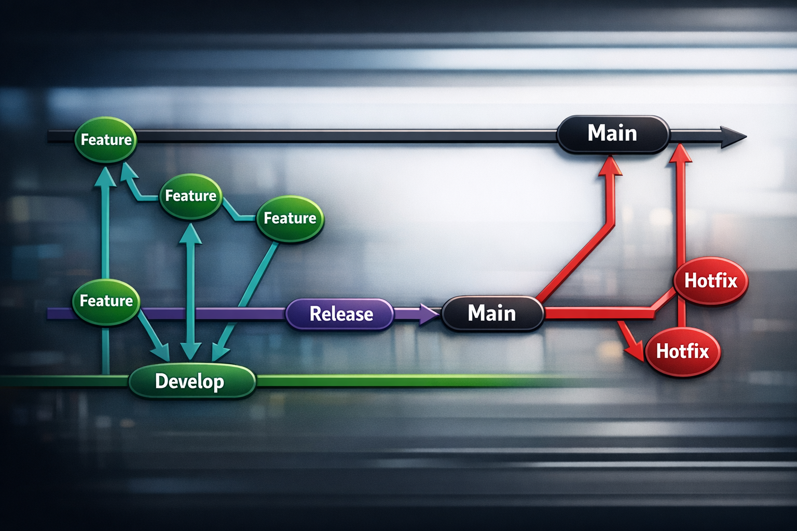

# Git Flow

A branching strategy for predictable delivery

Do we need it?

???

Core message: This presentation is about deciding whether Git Flow is the right branching strategy for the team—not a Git tutorial.

Talking points:
- Open by clarifying scope: “This is not about learning Git commands—we all know Git. This is about deciding how we use it together.”
- Frame the problem: we currently lack a shared model, and that’s creating friction.
- Introduce Git Flow as one candidate solution, not a foregone conclusion.
- Set expectation: by the end, we should have enough clarity to decide whether to trial or adopt.

Delivery approach:
- Keep tone collaborative, not prescriptive.
- Pause after “Do we need it?” and let that question land.
- Optionally ask: “How many of you have felt friction from our current branching setup?”

Background context:
- Git Flow is a structured model originally proposed by Vincent Driessen.
- It’s widely used in teams with scheduled releases and multiple contributors.

Transition:
- Move from the abstract question into the concrete reality of how we work today.

---

# Our Current Reality

+ Inconsistent branching approaches
+ Unclear release state
+ Merge conflicts + surprises

???

Core message: Our current lack of consistency is causing real, shared pain.

Talking points:
- Inconsistent branching: different developers use different strategies (feature branches, direct commits, long-lived branches).
- Unclear release state: it’s often not obvious what’s production-ready vs. still in progress.
- Merge conflicts and surprises: late integration leads to unexpected breakages and stressful merges.

Delivery approach:
- Keep it non-blaming: this is a system issue, not a people issue.
- Use relatable examples: “We’ve all seen PRs that suddenly explode with conflicts.”
- Slight pause after each point to let recognition build.

Background context:
- These issues scale with team size and parallel work.
- Without structure, coordination cost grows non-linearly.

Transition:
- Now connect these pains to why they actually matter for delivery and outcomes.

---

# Why This Matters

+ Slower releases
+ Risky deployments
+ Harder collaboration at scale

???

Core message: The inconsistency isn’t just annoying—it directly impacts speed, safety, and scalability.

Talking points:
- Slower releases: time lost resolving conflicts, figuring out state, coordinating merges.
- Risky deployments: uncertainty about what’s included increases the chance of bugs in production.
- Harder collaboration: as team size grows, lack of structure amplifies confusion.

Delivery approach:
- Emphasize consequences: “This is where we pay the price.”
- Slightly stronger tone here to build urgency.
- Ask: “How confident are we today when we hit deploy?”

Background context:
- High-performing teams optimize for predictable delivery, not just raw speed.
- Release confidence is a key engineering metric.

Transition:
- Introduce Git Flow as a structured way to address these exact problems.

---

# What Is Git Flow?

+ A structured branching model
+ Defines roles for each branch
+ Optimized for controlled releases

???

Core message: Git Flow provides a clear, shared structure for how code moves through the system.

Talking points:
- Structured model: not ad hoc branching—there’s a defined system.
- Roles for each branch: every branch has a purpose (development, production, fixes).
- Optimized for controlled releases: especially useful when releases are deliberate, not continuous.

Delivery approach:
- Keep it high-level—avoid commands or tooling.
- Position it as a “mental model” more than a rulebook.
- Emphasize clarity over complexity.

Background context:
- Git Flow contrasts with simpler models like trunk-based development.
- It’s particularly suited for teams with release cycles and QA phases.

Transition:
- Now explain the core philosophy behind the model.

---

# The Core Idea

+ Separate development from production
+ Use purpose-built branches
+ Make release state explicit

???

Core message: Git Flow is fundamentally about clarity—separating concerns and making state visible.

Talking points:
- Separation: development work doesn’t directly affect production stability.
- Purpose-built branches: each type of work has a designated place.
- Explicit release state: you always know what’s in development, staging, and production.

Delivery approach:
- Reframe as simplification, not added process.
- Emphasize: “This reduces ambiguity.”
- Pause after “Make release state explicit” to highlight its importance.

Background context:
- Many current issues stem from mixing concerns (features, fixes, releases).
- Explicit state reduces cognitive load across the team.

Transition:
- Show how this philosophy translates into actual branch types.

---

# Branch Types in Git Flow

???

Core message: Git Flow defines a small set of branch types, each with a clear role.

Talking points:
- main: represents production—always stable, always deployable.
- develop: integration branch where completed features accumulate.
- feature branches: short-lived branches for individual work, merged into develop.
- release branches: used to stabilize and prepare a release.
- hotfix branches: created from main to quickly patch production issues.

Delivery approach:
- Walk left to right through the diagram.
- Don’t rush—this is the most visually dense slide.
- Use your finger or cursor to trace flows if presenting live.

Background context:
- The power of Git Flow comes from enforcing these roles consistently.
- Most confusion in teams comes from unclear branch purpose.

Transition:
- Move from structure to behavior: how work actually moves through these branches.

---

# How Work Flows

???

Core message: Git Flow defines a predictable lifecycle for code from development to production.

Talking points:
- Feature → develop: developers branch off develop, complete work, merge back.
- Release → stabilize: a release branch is created to prepare for production (testing, fixes).
- Release → main: once stable, merged into main and tagged.
- Hotfix → patch production: urgent fixes branch from main and merge back into both main and develop.

Delivery approach:
- Tell it as a story: “A feature starts here… moves here… ends here.”
- Emphasize predictability: every change follows a known path.
- Pause after explaining hotfix flow—it’s often the most appreciated part.

Background context:
- This lifecycle reduces last-minute surprises.
- It also enables parallel work without destabilizing production.

Transition:
- Now connect this flow back to the problems we started with.

---

# What Improves

+ Clear release boundaries
+ Parallel work without chaos
+ Safer, traceable fixes

???

Core message: Git Flow directly addresses the pain points we identified earlier.

Talking points:
- Clear release boundaries: you always know what’s going out and what’s not.
- Parallel work: multiple features can progress independently without stepping on each other.
- Safer fixes: hotfixes are isolated, fast, and traceable.

Delivery approach:
- Explicitly tie back: “Remember earlier when we talked about unclear release state…”
- Slight emphasis on “traceable”—important for debugging and audits.

Background context:
- Traceability is critical in larger systems and regulated environments.
- Parallelism without chaos is a hallmark of mature engineering teams.

Transition:
- Acknowledge that this isn’t free—there are tradeoffs.

---

# Tradeoffs to Consider

+ More structure = more discipline
+ May feel heavy for small changes
+ Requires team alignment

???

Core message: Git Flow introduces overhead and only works if the team commits to it.

Talking points:
- More discipline: rules must be followed consistently to get value.
- Heavier for small changes: might feel like overkill for tiny fixes.
- Team alignment: partial adoption creates more confusion, not less.

Delivery approach:
- Be candid—this builds credibility.
- Slightly slower pacing to show thoughtfulness.
- Ask: “Would this feel like friction in our day-to-day?”

Background context:
- Some teams prefer trunk-based development for speed and simplicity.
- Git Flow is a tradeoff: structure vs. flexibility.

Transition:
- Bring it all together into a decision point.

---

# Decision Time

+ Does this solve our current pain?
+ Are we willing to standardize?
+ Next step: trial or adopt

???

Core message: The goal is not agreement on Git Flow itself, but a conscious decision on our branching strategy.

Talking points:
- Does it solve our pain: revisit the original issues—does this model address them?
- Willingness to standardize: success depends on consistency.
- Next step: propose a trial period (e.g., 2–4 weeks) or full adoption.

Delivery approach:
- Shift from presenting to facilitating discussion.
- Pause after each question—invite responses.
- Encourage dissent and concerns.

Background context:
- Adoption works best with a trial phase and clear guidelines.
- Success metrics could include fewer merge conflicts, clearer releases, faster stabilization.

Transition:
- Close by opening the floor: “Let’s decide how we want to move forward.”