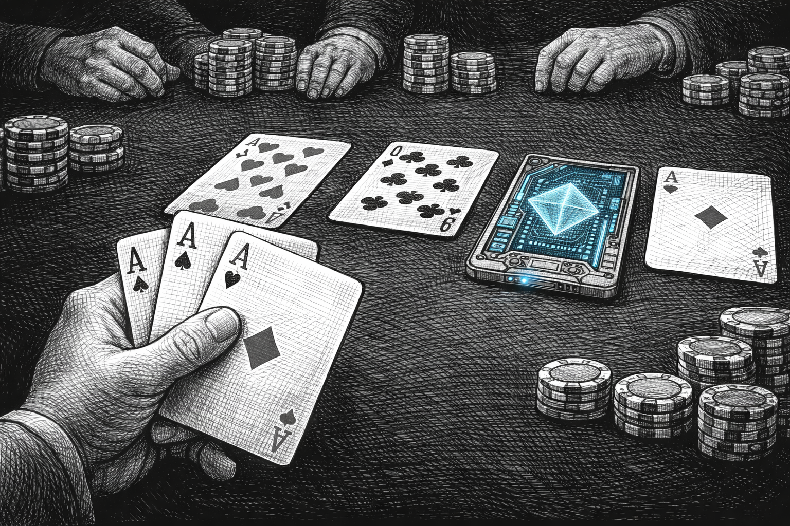
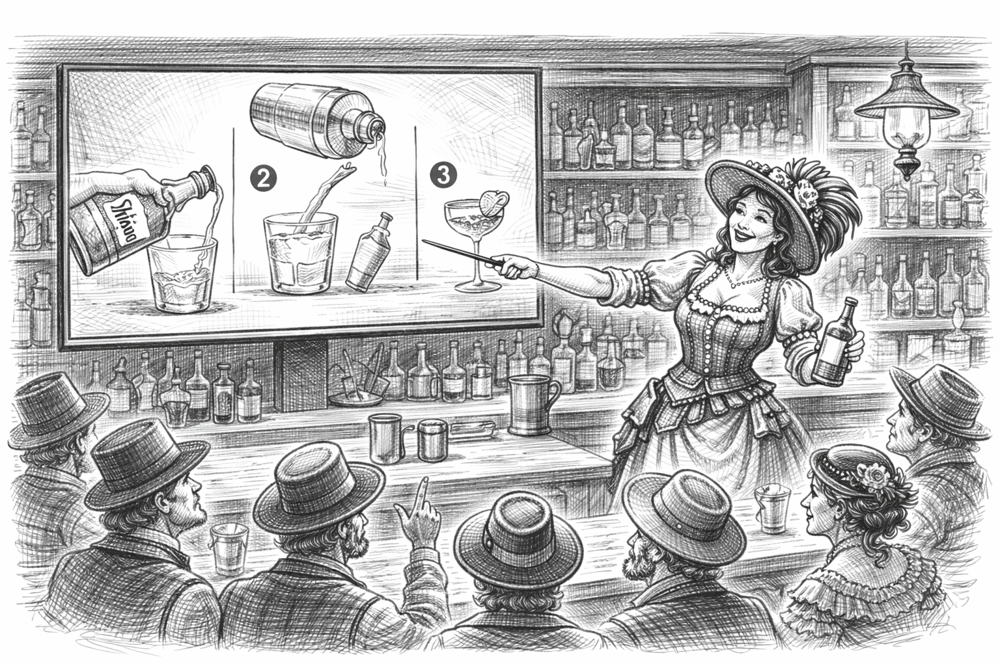
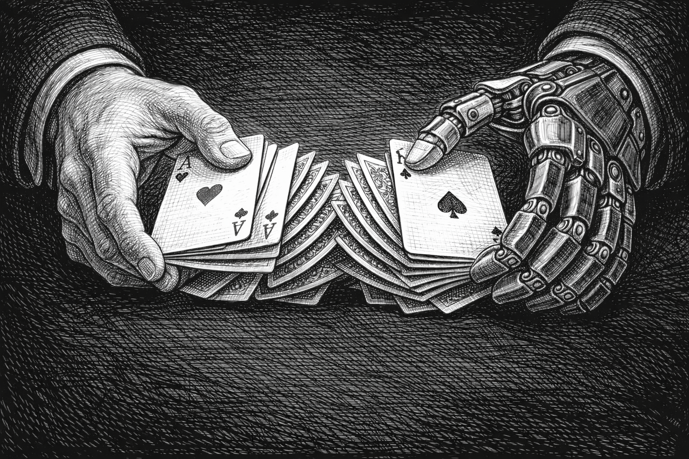
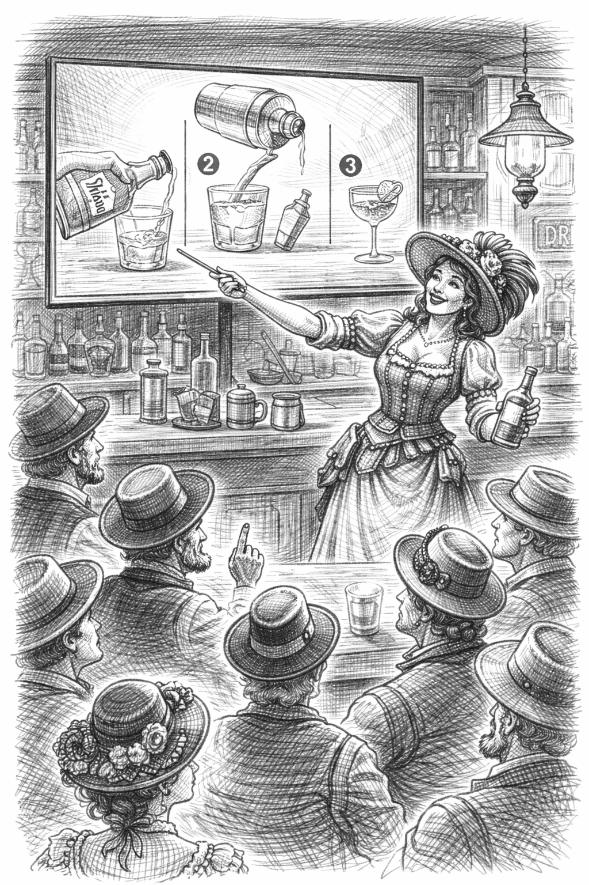

# Layout Test: Image Split Layouts
Testing image side-panel rendering in Bullet, Code, Quote, and Content layouts


# Bullet + Image

- First point about this topic
- Second point with more detail
- Third point wrapping up
- Fourth point for good measure


# Code + Image

```rust
fn main() {
    println!("Hello, world!");
    let x = 42;
    println!("The answer is {x}");
}
```




# Quote + Image

> The best way to predict the future is to invent it.

-- Alan Kay




# Content + Image

## Mixed Content Slide

This slide has a heading, a paragraph, and an image.

It should render as a content+image split layout.




# Bullet + Image (Ordered)

1. Step one of the process
2. Step two continues
3. Step three follows naturally
4. Final step completes


# Code + Image (Python)

```python
def fibonacci(n):
    if n <= 1:
        return n
    return fibonacci(n-1) + fibonacci(n-2)

for i in range(10):
    print(fibonacci(i))
```




# Image Only (No Change)


This should still use the Image layout.


# Gallery (No Change)


